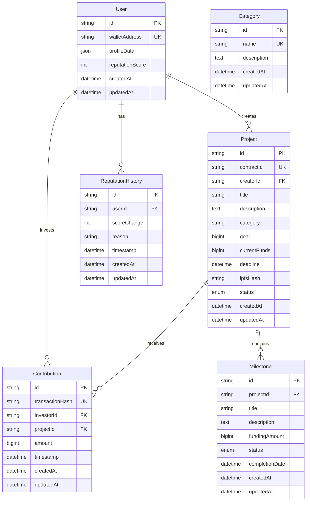

# NovaFund Database Entity Relationship Diagram

## Overview

This document describes the relational database schema for the NovaFund crowdfunding platform, designed to cache blockchain data and provide performant searching, filtering, and analytics capabilities.

## Entity Relationship Diagram



## Entity Descriptions

### User
Stores user profile information and reputation data from the blockchain.

**Fields:**
- `id`: Primary key (CUID)
- `walletAddress`: Unique Stellar wallet address
- `profileData`: JSON object containing user profile information
- `reputationScore`: User's reputation score (default: 0)
- `createdAt`: Record creation timestamp
- `updatedAt`: Last update timestamp

**Relationships:**
- One-to-many with Project (as creator)
- One-to-many with Contribution (as investor)
- One-to-many with ReputationHistory

### Project
Stores crowdfunding project information and metadata.

**Fields:**
- `id`: Primary key (CUID)
- `contractId`: Unique smart contract identifier
- `creatorId`: Foreign key to User table
- `title`: Project title
- `description`: Project description
- `category`: Project category
- `goal`: Funding goal amount (BigInt)
- `currentFunds`: Currently raised amount (BigInt, default: 0)
- `deadline`: Project deadline
- `ipfsHash`: IPFS hash for project files
- `status`: Project status (ACTIVE, COMPLETED, CANCELLED, SUSPENDED)
- `createdAt`: Record creation timestamp
- `updatedAt`: Last update timestamp

**Relationships:**
- Many-to-one with User (creator)
- One-to-many with Contribution
- One-to-many with Milestone

### Contribution
Records all investment contributions to projects.

**Fields:**
- `id`: Primary key (CUID)
- `transactionHash`: Unique blockchain transaction hash
- `investorId`: Foreign key to User table
- `projectId`: Foreign key to Project table
- `amount`: Contribution amount (BigInt)
- `timestamp`: Blockchain transaction timestamp
- `createdAt`: Record creation timestamp
- `updatedAt`: Last update timestamp

**Relationships:**
- Many-to-one with User (investor)
- Many-to-one with Project

### Milestone
Stores project milestone information for staged funding releases.

**Fields:**
- `id`: Primary key (CUID)
- `projectId`: Foreign key to Project table
- `title`: Milestone title
- `description`: Milestone description
- `fundingAmount`: Amount to release upon completion (BigInt)
- `status`: Milestone status (PENDING, APPROVED, REJECTED, COMPLETED, FUNDED)
- `completionDate`: Date when milestone was completed
- `createdAt`: Record creation timestamp
- `updatedAt`: Last update timestamp

**Relationships:**
- Many-to-one with Project

### ReputationHistory
Tracks changes to user reputation scores over time.

**Fields:**
- `id`: Primary key (CUID)
- `userId`: Foreign key to User table
- `scoreChange`: Change in reputation score (positive/negative)
- `reason`: Reason for reputation change
- `timestamp`: When the change occurred
- `createdAt`: Record creation timestamp
- `updatedAt`: Last update timestamp

**Relationships:**
- Many-to-one with User

### Category
Stores project categories for classification and filtering.

**Fields:**
- `id`: Primary key (CUID)
- `name`: Unique category name
- `description`: Category description
- `createdAt`: Record creation timestamp
- `updatedAt`: Last update timestamp

**Relationships:**
- No direct relationships (referenced by Project.category)

## Enums

### ProjectStatus
- `ACTIVE`: Project is actively fundraising
- `COMPLETED`: Project successfully completed
- `CANCELLED`: Project was cancelled
- `SUSPENDED`: Project is temporarily suspended

### MilestoneStatus
- `PENDING`: Awaiting approval
- `APPROVED`: Approved for funding
- `REJECTED`: Funding request rejected
- `COMPLETED`: Milestone completed but not yet funded
- `FUNDED`: Milestone completed and funded

## Indexes and Performance

### Recommended Indexes
```sql
-- User table
CREATE INDEX idx_users_wallet_address ON users(wallet_address);
CREATE INDEX idx_users_reputation_score ON users(reputation_score);

-- Project table
CREATE INDEX idx_projects_creator_id ON projects(creator_id);
CREATE INDEX idx_projects_status ON projects(status);
CREATE INDEX idx_projects_category ON projects(category);
CREATE INDEX idx_projects_deadline ON projects(deadline);
CREATE INDEX idx_projects_created_at ON projects(created_at);

-- Contribution table
CREATE INDEX idx_contributions_investor_id ON contributions(investor_id);
CREATE INDEX idx_contributions_project_id ON contributions(project_id);
CREATE INDEX idx_contributions_timestamp ON contributions(timestamp);
CREATE INDEX idx_contributions_amount ON contributions(amount);

-- Milestone table
CREATE INDEX idx_milestones_project_id ON milestones(project_id);
CREATE INDEX idx_milestones_status ON milestones(status);

-- ReputationHistory table
CREATE INDEX idx_reputation_history_user_id ON reputation_history(user_id);
CREATE INDEX idx_reputation_history_timestamp ON reputation_history(timestamp);
```

## Data Flow

1. **User Registration**: User records are created when wallets first interact with the platform
2. **Project Creation**: Projects are linked to creators via `creatorId`
3. **Contributions**: Each investment creates a Contribution record linked to both user and project
4. **Milestone Management**: Milestones are created per project with staged funding releases
5. **Reputation Tracking**: User actions update reputation scores and create history records

## Notes

- All monetary values use `BigInt` to handle large amounts safely
- Timestamps use UTC timezone
- JSON fields provide flexibility for storing additional metadata
- Foreign key constraints ensure data integrity
- Indexes optimize for common query patterns (filtering by status, category, user, etc.)

## Migration Strategy

When ready to deploy:

1. Run `npx prisma migrate dev --name init` to create initial migration
2. Apply migration to PostgreSQL database
3. Set up replication from blockchain events to keep cache synchronized
4. Implement data validation and cleanup jobs
